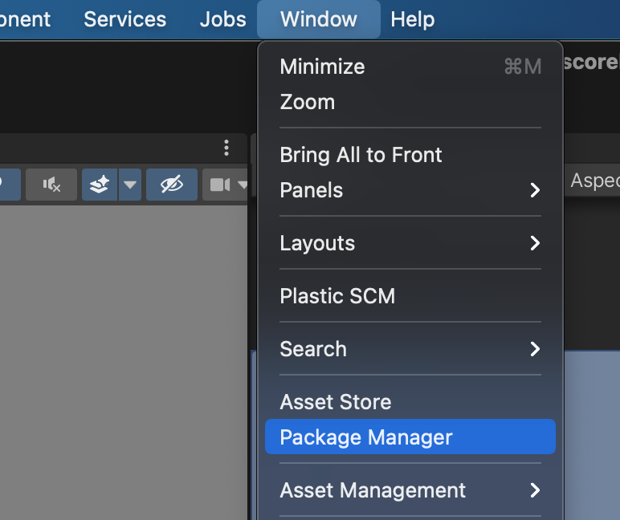
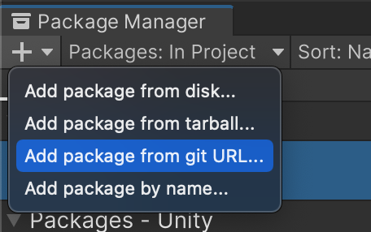
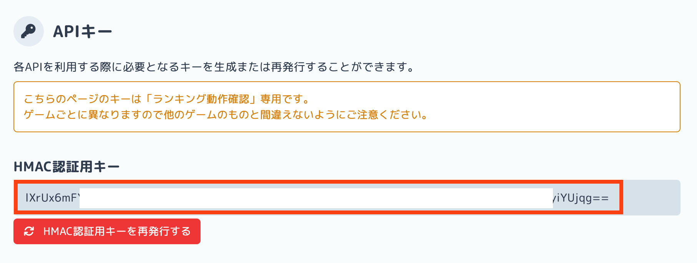

# unityroom-sdk

unityroom-sdkはフリーゲーム投稿サイト[unityroom](https://unityroom.com/)のAPIクライアントライブラリです。UnityからunityroomのAPIを呼び出すための各種機能を提供します。

## セットアップ

### Unity側

#### 要件

* Unity 2021.2 以上

#### Package Managerからインストール (推奨)

1. Window > Package ManagerからPackage Managerウィンドウを開く
    * 

2. "+" > Add package from git URL...
   * 

3. 以下のURLを入力してAddを押す   
    ```plaintext
    https://github.com/unityroom/unityroom-sdk.git?path=src/Unityroom.Client/Assets/Unityroom.Client
    ```

### unityroom側

1. [こちら](https://unityroom-help.notion.site/4fae458305a948818b90e50dcad6a3f3?pvs=4)の手順に従い、unityroom側でのセットアップを行う
2. APIキー画面からHMAC認証用キーを取得
    * 

### UniTaskの導入

必須ではありませんが、WebGL上でasync/awaitを扱うために
[UniTask](https://github.com/Cysharp/UniTask?tab=readme-ov-file#install-via-git-url)を導入することをお勧めします。

「Package Managerからインストール」の項目と同じ手順でPackage Managerを開き、以下のURLを入力します。

```plaintext
https://github.com/Cysharp/UniTask.git?path=src/UniTask/Assets/Plugins/UniTask
```

## 使い方

`UnityroomClient`を使用してunityroom APIの呼び出しを行うことができます。

```cs
using System.Threading;
using System.Threading.Tasks; // Taskの利用に必要
using UnityEngine;
using Unityroom.Client; // UnityroomClientの利用に必要

public class Example : MonoBehaviour
{
    // 新たなUnityroomClientを作成してフィールドにキャッシュしておく
    UnityroomClient client = new()
    {
        // HmacKeyにAPIキー画面から取得したHMAC認証用キーを渡します
        HmacKey = "insert_hmac_key_here"
    };

    // 使用後はOnDestroyなどでDisposeを呼び出して破棄する
    void OnDestroy()
    {
        client.Dispose();
    }
}
```

### スコアの送信

ランキングにスコアを送信するには`Scoreboards.SendAsync()`を使用します。

```cs
// サンプルとしてStart関数内で送信を行う
// awaitを使用するため、メソッドにasyncキーワードを付与しTaskを戻り値にする
async Task Start()
{
    await client.Scoreboards.SendAsync(new()
    {
        ScoreboardId = 1,   // スコアボードのId
        Score = 100,        // 送信するスコアの値
    });
}
```

>[!IMPORTANT]
> `SendAsync`等のメソッドの呼び出しは原則として`await`で待機するようにしてください。過剰なリクエストの送信を防ぐため、同時実行数の制限を超えると例外が発生するようになっています。

スコアが更新されたかどうかは、戻り値の`SendScoreResponse`の`ScoreUpdated`から確認できます。

```cs
async Task Start()
{
    var response = await client.Scoreboards.SendAsync(new()
    {
        ScoreboardId = 1,
        Score = 100,
    });

    // スコアが更新された時だけ処理を行う
    if (response.ScoreUpdated)
    {
        Debug.Log("スコアが更新されました");
    }
}
```

APIのレート制限を避けるため、Update関数などの頻繁に呼び出される箇所からリクエストを行わないでください。定期的にスコアの更新を行いたい場合には、asyncメソッドのループの使用を推奨します。

以下のコードはUniTaskを用いて一定間隔でスコアの送信を行うサンプルです。

```cs
using System.Threading;
using Cysharp.Threading.Tasks; // UniTaskの使用に必要
using UnityEngine;
using Unityroom.Client;

public class Example : MonoBehaviour
{
    UnityroomClient client = new()
    {
        HmacKey = "insert_hmac_key_here"
    };

    void Start()
    {
        // Start関数などの初期化時にasyncループを起動する
        // GameObjectがDestroyされた際に止まるようにCancellationTokenを渡すこと
        UpdateScoreAsync(this.GetCancellationTokenOnDestroy());
    }

    async UniTask UpdateScoreAsync(CancellationToken cancellationToken)
    {
        // キャンセルされるまで処理を繰り返す
        while (true)
        {
            // スコアの送信
            await client.Scoreboards.SendAsync(new()
            {
                ScoreboardId = 1,
                Score = 100,
            });

            // 数秒の間隔を挟む
            await UniTask.WaitForSeconds(5f);
        }
    }

    void OnDestroy()
    {
        client.Dispose();
    }
}
```

## 高度な機能

### 例外処理

APIの呼び出しに失敗した場合には`UnityroomApiException`がスローされます。これをcatchすることで例外の種類を判別し、適切なハンドリングを行うことができます。

```cs
try
{
    var response = await client.Scoreboards.SendAsync(new()
    {
        ScoreboardId = 1,
        Score = 100
    });
}
catch (UnityroomApiException ex)
{
    Debug.Log("送信失敗");

    Debug.Log("エラーコード: " + ex.Code);
    Debug.Log("エラーの種類: " + ex.Type);
    Debug.Log("メッセージ: " + ex.Message);
}
```

エラーコードの一覧は[こちら](https://help.unityroom.com/1945cff8a8e3422db82bc8052b9b2dfc)から確認できます。

### リトライ

rate_limit_exceededなどの特定のエラーに対しては、デフォルトで2回のリトライが行われます。最大リトライ回数を設定するには`UnityroomClient`の`MaxRetries`プロパティの値を変更します。

```cs
var client = new UnityroomClient()
{
    HmacKey = "...",
    MaxRetries = 5, // リトライ回数を設定
}
```

### タイムアウト

タイムアウトの時間を設定するにはするには`UnityroomClient`の`Timeout`プロパティを変更します。

```cs
var client = new UnityroomClient()
{
    HmacKey = "...",
    Timeout = TimeSpan.FromSeconds(5.0), // タイムアウトを5秒に変更
}
```

タイムアウト時には`TimeoutException`がスローされます。

## ライセンス

このライブラリはMITライセンスの下で公開されています。